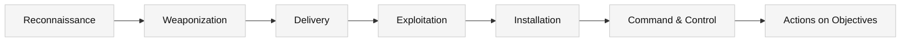

# Cyber Kill Chain® — Practical Defender’s Guide

A copy‑paste‑ready README you can drop into a repo or internal wiki to explain, map, and **operationalize** the Kill Chain for blue‑team work.

> Goal: turn an abstract model into concrete controls, detections, and tests you can run today.

---

## TL;DR

The **Cyber Kill Chain (CKC)** describes seven stages attackers move through to achieve objectives. Defenders can **prevent, detect, and disrupt** at each stage by mapping controls and detections to the activities that happen there.

1. **Reconnaissance** → 2. **Weaponization** → 3. **Delivery** → 4. **Exploitation** → 5. **Installation** → 6. **Command & Control** → 7. **Actions on Objectives**

---

## Visual


---

## Why CKC still matters

- Gives executives and engineers a **common language** for attack progress.
- Helps SOCs build **use cases** (“detections per stage”) and **coverage matrices**.
- Complements ATT&CK® by **grouping** techniques into an end‑to‑end flow.

---

## Quickstart (use this in your org/lab)

1) **List data sources** you already have (e.g., O365/Exchange, endpoint EDR, DNS, firewall, identity, SaaS).  
2) **Map each source to stages** (table below).  
3) **Pick 1–2 detections per stage** to implement this week.  
4) **Test with atomic simulations** (e.g., run one benign test per stage).  
5) **Record outcomes** (alert? blocked? logged?) and create **gaps → tasks**.  
6) **Track KPIs**: MTTD/MTTR by stage, % coverage, false‑positive rate.

---

## Stage‑by‑Stage Playbook

### 1) Reconnaissance
**What attackers do:** OSINT, target discovery, cloud/service enumeration, password spraying against public endpoints.  
**ATT&CK:** TA0043 (Reconnaissance), TA0001 (Initial Access – credential stuffing).  
**Signals & logs:** Web access logs, WAF/CDN, DNS query volume anomalies, identity sign‑in logs (failed logins from new IP ranges).  
**Prevent/Detect:**
- Enable **rate limits/WAF**, geo/ASN filtering where appropriate.
- Monitor **password spray patterns** (many usernames, one password).
- Alert on **enumeration endpoints** (/.well-known, /_api/, auth endpoints).  
**Test ideas:** Run a benign wordlist against a staging login; crawl your own site and review WAF logs.

---

### 2) Weaponization
**What attackers do:** Build malware/phish kits, craft payloads, stage infra.  
**ATT&CK:** TA0001/TA0002 prep; T1587 (Develop Capabilities).  
**Signals & logs:** Usually **off‑network**; infer via later stages (delivery artifacts, builder mutexes, repeat kit “fingerprints”).  
**Prevent/Detect:** Content disarm & reconstruction (CDR) for risky file types; sandbox detonation in mail/web gateways.  
**Test ideas:** Submit known benign EICAR and office macro samples to your sandbox; capture IOCs your tools generate.

---

### 3) Delivery
**What attackers do:** Phishing, drive‑by, USB, supply chain, chat/IM links.  
**ATT&CK:** TA0001 (Initial Access).  
**Signals & logs:** Secure mail gateway (SMG), O365/Google Workspace message trace, web proxy, URL sandbox reports.  
**Prevent/Detect:** 
- **SPF/DKIM/DMARC** enforced, banner/tag external mail, URL rewrite/sandbox.
- **Block high‑risk file types** from the internet (e.g., ISO, VHD, HTA).  
**Test ideas:** Send a harmless internal phishing simulation with an inert payload and confirm the controls’ outcomes.

**Sample KQL (Microsoft 365 Defender – emails with detonations):**
```kusto
EmailEvents
| where Timestamp > ago(7d)
| where DeliveryAction in ("Delivered","DeliveredAsJunk")
| where ThreatTypes has_any ("Phish","Malware")
| project Timestamp, RecipientEmailAddress, SenderFromDomain, Subject, ThreatTypes, NetworkMessageId
```

---

### 4) Exploitation
**What attackers do:** Exploit a vulnerability or abuse a feature (macros, LOLBAS), attempt initial code execution.  
**ATT&CK:** TA0001, TA0002 (Execution).  
**Signals & logs:** EDR process tree anomalies, exploit guard events, application crash logs, PowerShell/ScriptBlock logs.  
**Prevent/Detect:** 
- Patch management & **virtual patching** (WAF/IPS).
- **Application control** (block unsigned macros, restrict LOLBAS like `rundll32`, `wscript`, `mshta`).
- **Constrained PowerShell**, AMSI on.  
**Test ideas:** Atomic test for macro-disabled flow; simulate `regsvr32 /s /n /u /i:... scrobj.dll` and verify alerting.

**Sample KQL (suspicious LOLBAS execution):**
```kusto
DeviceProcessEvents
| where Timestamp > ago(7d)
| where FileName in ("rundll32.exe","regsvr32.exe","mshta.exe","wscript.exe","powershell.exe")
| where ProcessCommandLine has_any ("http://","https://",".js",".vbs",".sct")
| project Timestamp, DeviceName, InitiatingProcessFileName, FileName, ProcessCommandLine, AccountName
```

---

### 5) Installation
**What attackers do:** Dropper installs persistence (registry run keys, services, scheduled tasks), deploys implants.  
**ATT&CK:** TA0003 (Persistence), TA0002 (Execution).  
**Signals & logs:** New services/tasks, autoruns, uncommon DLL loads, changes to `Run` keys; EDR persistence artifacts.  
**Prevent/Detect:** 
- **Block unsigned drivers**, require admin for service install.
- Monitor **ScheduledTask** creation and **Autoruns** locations.  
**Test ideas:** Create a benign scheduled task; confirm detection & triage playbook.

**Sample KQL (new scheduled task):**
```kusto
DeviceRegistryEvents
| where Timestamp > ago(7d)
| where RegistryKey startswith @"HKLM\SOFTWARE\Microsoft\Windows NT\CurrentVersion\Schedule\TaskCache\Tasks"
| summarize count() by DeviceName, bin(Timestamp, 1h)
```

---

### 6) Command & Control (C2)
**What attackers do:** Establish a channel to remote infra (HTTP(S), DNS, cloud apps, IM).  
**ATT&CK:** TA0011 (Command and Control).  
**Signals & logs:** DNS (beaconing intervals, DGA), proxy/firewall egress, EDR network events, TLS JA3/JA3S fingerprints.  
**Prevent/Detect:** 
- **Egress filtering** and **DNS filtering**; block newly registered domains.
- Detect **beaconing** (low‑and‑slow periodicity) and **protocol misuse**.
- TLS inspection where policy allows.  
**Test ideas:** Use a benign simulator that beacons at fixed intervals; verify detections.

**Sample KQL (simple beaconing heuristic):**
```kusto
DeviceNetworkEvents
| where Timestamp > ago(24h)
| where RemoteUrl != "" or RemoteIP != ""
| summarize hits=count(), firstSeen=min(Timestamp), lastSeen=max(Timestamp), avgDelta=avgiff(toint(datetime_diff('second', Timestamp, prev(Timestamp))), isnotnull(prev(Timestamp)), long(null)) by DeviceName, RemoteIP, RemoteUrl
| where hits > 15 and avgDelta between (50 .. 400)  // crude periodicity window
| project DeviceName, RemoteIP, RemoteUrl, hits, avgDelta, firstSeen, lastSeen
```

---

### 7) Actions on Objectives
**What attackers do:** Credential access, lateral movement, collection, exfiltration, impact (ransom, wipe).  
**ATT&CK:** Multiple: TA0006–TA0010, TA0010 (Exfiltration), TA0040 (Impact).  
**Signals & logs:** Directory/Identity logs, file access telemetry, SMB/RPC, cloud storage, DLP, unusual compression + outbound transfer.  
**Prevent/Detect:** 
- **Least privilege**, admin tiering, MFA, conditional access.
- **DLP** and **Egress monitoring**; block mass cloud downloads or sharing to “anyone with link.”  
**Test ideas:** Copy a sample dataset and compress it; attempt an outbound upload to a sanctioned sink; confirm DLP & alerts.

**Sample KQL (sudden data staging):**
```kusto
DeviceFileEvents
| where Timestamp > ago(24h)
| where FileName endswith ".zip" or FileName endswith ".7z"
| summarize FilesCreated=count() by DeviceName, bin(Timestamp, 30m)
| where FilesCreated > 20
```

---

## CKC ↔ MITRE ATT&CK (high‑level mapping)

| Kill Chain Stage        | Typical ATT&CK Tactics (examples)                         |
|---|---|
| Reconnaissance          | TA0043 Reconnaissance, TA0001 Initial Access (spray)      |
| Weaponization           | T1587 Develop Capabilities                                |
| Delivery                | TA0001 Initial Access (Phishing, Drive‑by)                |
| Exploitation            | TA0002 Execution, TA0001 Initial Access                    |
| Installation            | TA0003 Persistence, TA0002 Execution                      |
| Command & Control       | TA0011 Command and Control                                 |
| Actions on Objectives   | TA0006–TA0010 (Credential Access, Discovery, Lateral Movement, Collection, Exfiltration), TA0040 Impact |

> Use ATT&CK for **technique‑level detail** and CKC for the **narrative** of an intrusion.

---

## Coverage Matrix Template

Track your **controls and detections** by stage.

| Stage | Controls (Prevent) | Detections (Detect) | Data Sources | Tests | Owner |
|---|---|---|---|---|---|
| Recon | WAF, Rate limit, CAPTCHAs | Spray detection, enum alerts | WAF, IdP logs, DNS | Enum against staging | |
| Delivery | SMG, DMARC, URL sandbox | Suspicious attachments/links | Mail, Sandbox, Proxy | Phish sim | |
| Exploit | Patch, App Control | LOLBAS, macro exec | EDR, Script logs | Atomic tests | |
| Install | Admin guardrails | New service/task/autoruns | EDR, Sysmon | Create benign task | |
| C2 | Egress/DNS filtering | Beaconing, DGA | DNS, Proxy, EDR | Beacon simulator | |
| Objectives | DLP, Least privilege | Mass zip, exfil | DLP, EDR, Cloud logs | Bulk copy/upload | |

---

## KPIs & Reporting

- **% Coverage** by stage (≥1 prevention + ≥1 detection each).  
- **MTTD/MTTR** by stage.  
- **Block rates**: delivery/exploit prevented at the edge.  
- **Drill cadence**: at least **quarterly** full‑chain tabletop + atomic tests.

---

## Limitations & Gotchas

- CKC is **linear**; real intrusions loop and branch. Pair it with ATT&CK or the **Unified Kill Chain** for multi‑vector campaigns.  
- Not all stages are directly observable (e.g., Weaponization). You infer via downstream artifacts.  
- Don’t chase perfect coverage—**land a small win per stage**, iterate.

---

## References (start here)

- Lockheed Martin: *Intelligence‑Driven Computer Network Defense Informed by Analysis of Adversary Campaigns and Intrusion Kill Chains* (2011).  
- MITRE ATT&CK®: https://attack.mitre.org/  
- Unified Kill Chain: https://unifiedkillchain.com/  
- NIST CSF (Identify → Protect → Detect → Respond → Recover): https://www.nist.gov/cyberframework

---

### Changelog
- August 24, 2025: Initial version.
